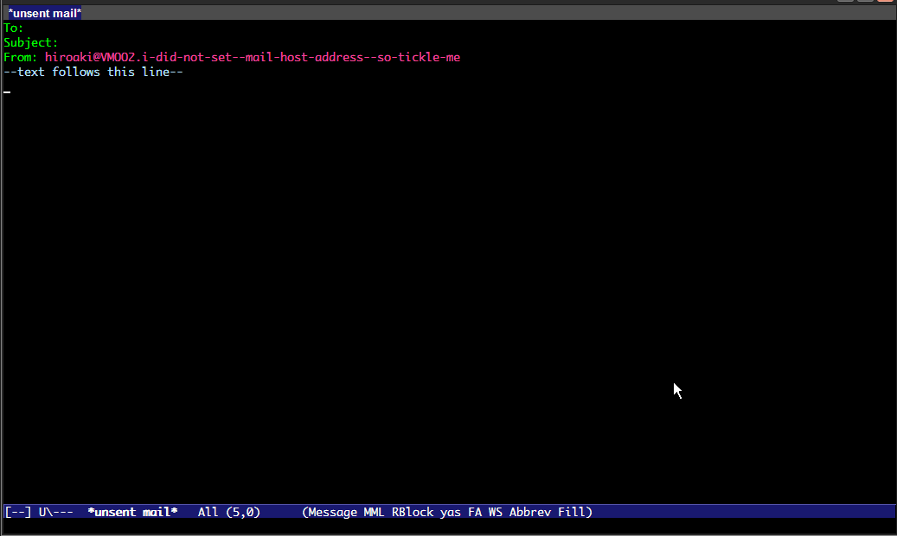

[Japanese](https://github.com/aki2o/bbdb-/blob/master/README-ja.md)

What's this?
============

This is a extension of Emacs that provides more easily search/choice than BBDB.  

BBDB is a address book for MUA like Gnus/Wanderlust.  
http://savannah.nongnu.org/projects/bbdb


Demo
====




Feature
=======

### Incremental Search

The matched record is listed interactively by incremental search like anything.el/helm.el.  
If migemo.el is available, use migemo search in default.  

### Select To/Cc/Bcc at a time

You can do/undo choice of To/Cc/Bcc for one/all of the listed record.  
The following mark is shown at head of the selected record.  

* T ... To
* C ... Cc
* B ... Bcc


Install
=======

### If use package.el

2014/02/01 It's available by using melpa.  

### If use el-get.el

2014/01/31 Not yet available.  

### If use auto-install.el

```lisp
(auto-install-from-url "https://raw.github.com/aki2o/bbdb-/master/bbdb-.el")
```

\* In this case, you need to install each of the following dependency.  

### Manually

Download bbdb-.el and put it on your load-path.  

\* In this case, you need to install each of the following dependency.  

### Dependency

* [bbdb.el](http://savannah.nongnu.org/projects/bbdb)
* [log4e.el](https://github.com/aki2o/log4e)
* [yaxception.el](https://github.com/aki2o/yaxception)

#### About bbdb.el

The target version of bbdb.el is which is published on melpa for package.el.  
bbdb.el seems being published from several web site/service.  
But if compatibility has not been kept between them, anything else may not go on well.  


Configuration
=============

```lisp
(require 'bbdb-)

;; If necessary, customize arbitrarily. About item of customize, eval the following sexp.
;; (customize-group "bbdb-")

;; Do setup
(bbdb-:setup)
```


Usage
=====

### Start

Execute `bbdb-:open` or `bbdb-:start-completion`.  
`bbdb-:start-completion` is better in the buffer that you write mail on.  
In default, you can execute `bbdb-:start-completion` by pushing the key that is bound for `bbdb-complete-mail`.  
Alternatively, set `bbdb-:start-completion-key`.  
Otherwise, do key binding by yourself.  

### Keymap of bbdb-

The bbdb- buffer, which is named \*bbdb-\* and shown at the start, have the following keymap.  

* **j** ... Go to next record
* **k** ... Go to previous record
* **h** ... Go to previous char
* **l** ... Go to next char
* **J** ... Scroll down
* **K** ... Scroll up
* **s** ... Start incremental search
* **S** ... Start incremental search with the reverse configuration about using migemo
* **a** ... Show all record
* **t** ... Mark current record as To
* **c** ... Mark current record as Cc
* **b** ... Mark current record as Bcc
* **u** ... Unmark current record 
* __\* t__ ... Mark all listed record as To
* __\* c__ ... Mark all listed record as Cc
* __\* b__ ... Mark all listed record as Bcc
* __\* u__ ... Unmark all listed record
* **R** ... Reload the latest record of BBDB
* **q** ... Finish with doing nothing
* **RET** ... Finish with the update of To/Cc/Bcc header (if necessary, open the mail buffer)


Consideration
=============

### If you update record of BBDB

The bbdb- buffer is created from the record of BBDB at first, and then that is reused.  
So, if you add/update/remove record of BBDB, execute reload for reflection of it.  


Tested On
=========

* Emacs ... GNU Emacs 24.2.1 (i386-mingw-nt5.1.2600) of 2012-12-08 on GNUPACK
* bbdb.el ... 20140123.1541
* log4e.el ... 0.2.0
* yaxception.el ... 0.1


**Enjoy!!!**

